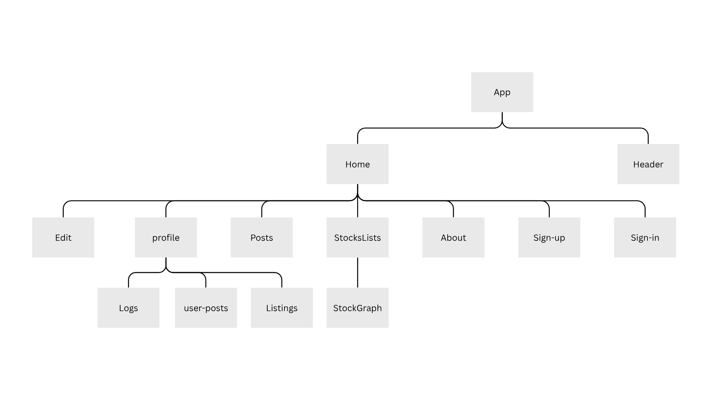
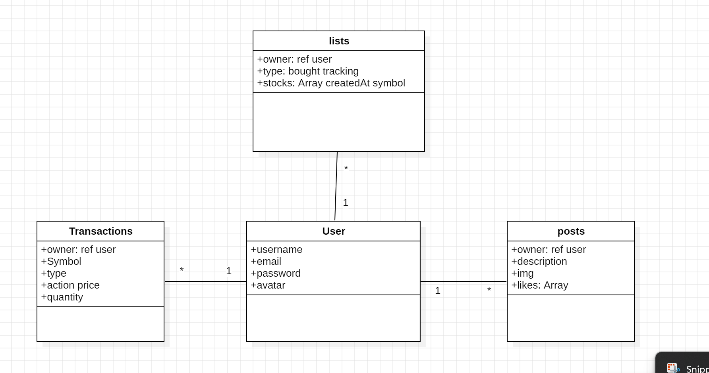
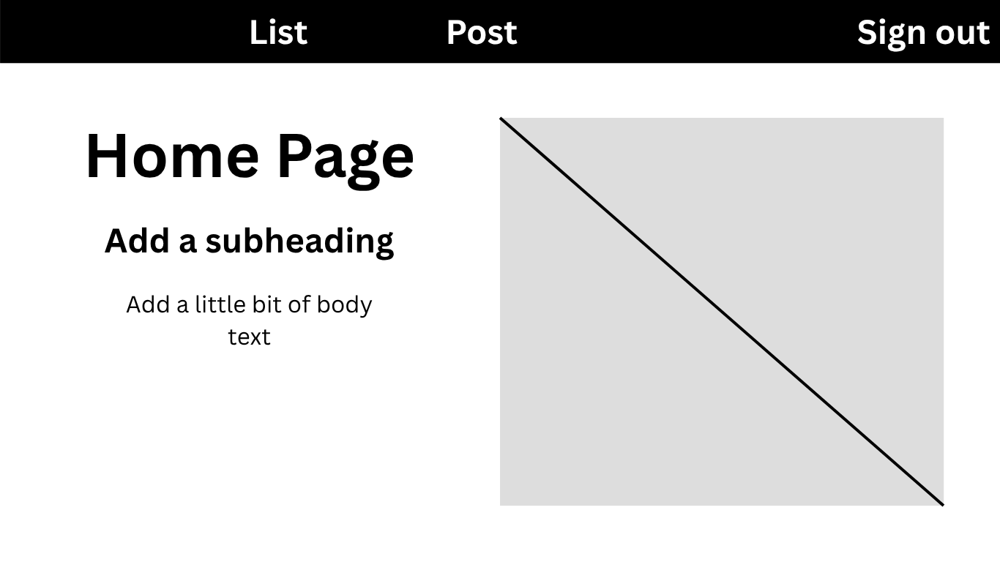
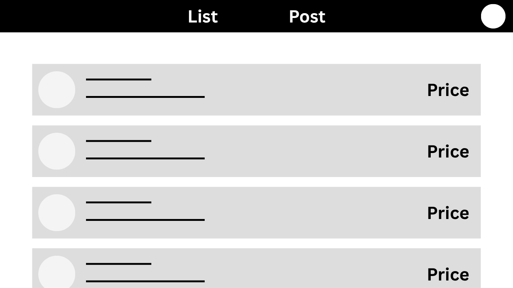
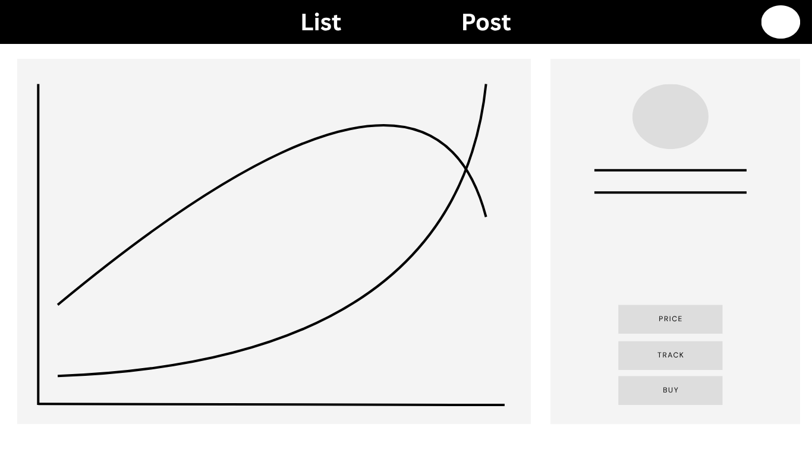

# Stocker (front-end)

# Date 4/8/2025

# By:

- [Manaf Hujairi](https://github.com/Manaf-10)
- [Feras Darwish](https://github.com/alqaassass)
- [Ali Alqassas](https://github.com/alqaassass)

# Description

a MERN website that allows the user to create an account ,
and can observe the stocks prices of the public company , users can buy or sells
their shares of those stocks and can also view their profit or loss while also being
able to track specific stocks if they change in price , the website represents the
state of the stock of a company through a line chart that can make it easy to
make decisions and easy new users to the stock market , can also send posts and veiw posts of others related to stocks and their buying options

# Component Hierarchy

  
  

# ERD

  
  

# Wireframes

  
  

  
  

  
  

### and you can view more from  [here](https://www.canva.com/design/DAGvYY53A_A/Ys5SFNqTUrPE1dNtHWTxYQ/edit)
  

# Technologies Used

- JavaScript
- React
- Node.js
- Css
- Mongoose
- bcrypt

# Credits

- Graphs: [Charts.js](https://www.chartjs.org)
- Stocks API: [Alpha Vantage](https://www.alphavantage.co)
- Animated  background: [vantajs](https://www.vantajs.com/)
- Boostrab: [getbootstrap](https://getbootstrap.com/)
